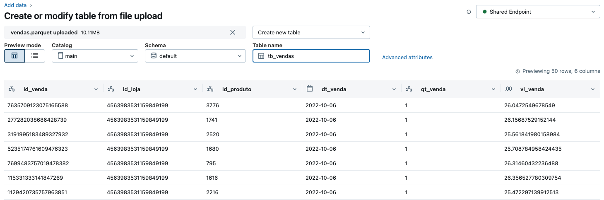

# 01. Crie um database caso ainda não possua
``` sql
USE CATALOG jessyca_demos;

CREATE DATABASE IF NOT EXISTS genie_workshop;
```

## 02. Importe os Arquivos

1. As informações que serão utilizadas no workshop estão na pasta `/dados` aqui no repositório Github, faça download dos arquivos
2. No menu `New` > `Add or upload data`


3. Selecione `Create or modify table`


4. Selecione os arquivos `.parquet` e os importe como tabelas definindo o catálogo, schema e nome das tabelas a serem utilizadas
- Os nomes definidos para o workshop foram `tb_vendas`, `tb_estoque`, `dim_medicamento`, `dim_loja`



