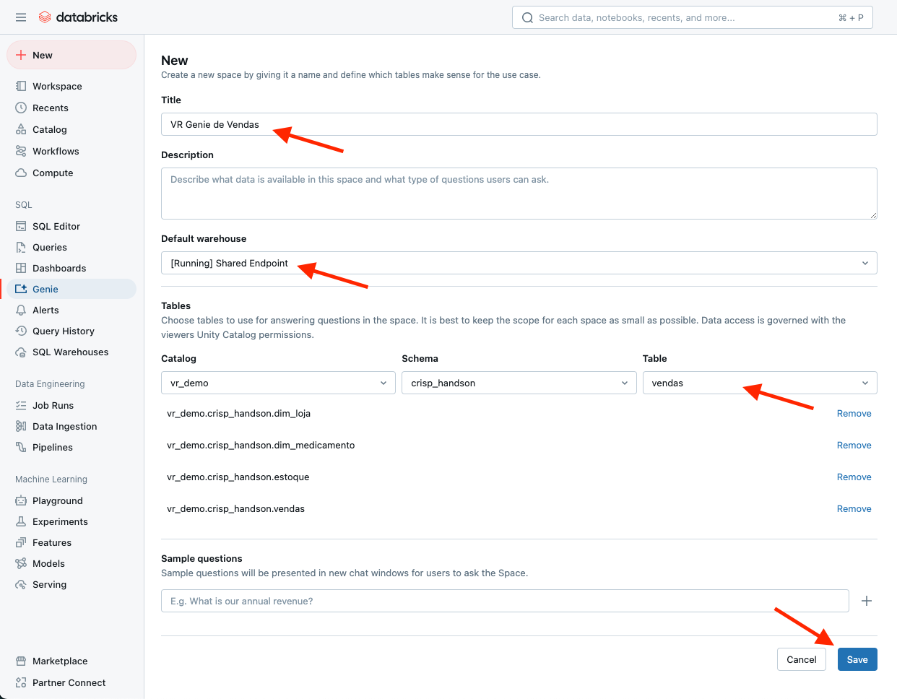
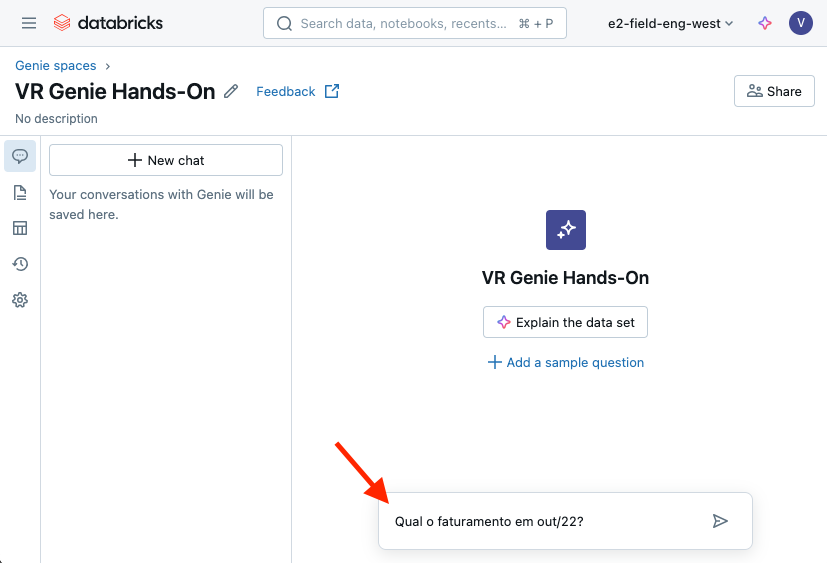
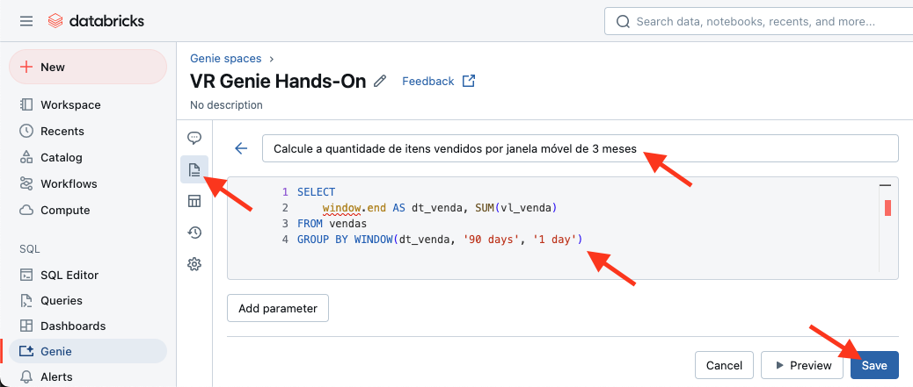

# 01. Criar o Genie Space

1. No menu principal (à esquerda), clique em `New` > `Genie space`

<br><br>

# 02. Configure o Genie

1. Defina o nome do Genie Space com um nome que considere adequado para a execução dos exercícios
2. Selecione as tabelas criadas
        - tb_vendas
        - tb_estoque
        - dim_medicamento
        - dim_loja
3. Clique em `Save`



# 03. Faça perguntas para o Genie

Com o Genie Space preparado, podemos começar a fazer nossas análises!

Basta usar o chat para fazer as perguntas abaixo:
- Qual o faturamento em out/22?
- Agora, quebre por produto
- Mantenha somente os 10 produtos com maior faturamento
- Monte um gráfico de barras
- Qual o total de produtos vendidos em genéricos?
- Qual o valor total vendido de ansiolíticos?
- Quais produtos tiveram uma proporção de vendas por estoque maior que 0.8 em Outubro de 2022?

<br><br>

Note que, mesmo com muito pouco contexto, a Genie já conseguiu:
- Inferir quais as tabelas e colunas relevantes para responder nossas perguntas
- Aplicar filtros e agregações
- Responder perguntas adicionais sobre uma resposta anterior
- Entender como utilizar jargões
- Combinar diferentes tabelas
- Calcular métricas derivadas

Aproveite para explorar e fazer perguntas adicionais!

# 04. Usando Comentários

Faça a seguinte pergunta:
- Qual o valor total de venda por loja? Exiba o nome da loja

Note que, apesar de o Genie identificar as tabelas que utilizaria para trazer esse resultado, ele não foi capaz de responder à pergunta de forma correta. Por quê?

No menu `Catalog` > `<nome-do-catalogo>` > `<nome-do-schema>` > `dim_loja`, verifique o nome da coluna que apresenta o nome da loja


A coluna que contém o nome da loja não está com uma nomenclatura adequada para que o Genie consiga se basear por ela. Vamos adicionar um comentário nessa coluna para que seja possível utilizar a coluna correta para apresentar a informação pedida.
1. Acesse o SQL Editor
2. Altere a tabela adicionando o comentário para a coluna **nlj**
`ALTER TABLE dim_loja ALTER COLUMN nlj COMMENT 'Nome da loja'`
3. Faça a pergunta **Qual o valor total de venda por loja? Exiba o nome da loja**

Perceba que dessa vez o Genie utilizou a coluna correta que contém o nome da loja. Documentar as tabelas com comentários é sempre uma boa prática! Isso ajuda a compreensão, a descoberta e o reaproveitamento desses dados por outras pessoas. Além disso, o Genie vai ficar bem mais inteligente.

No entanto, nossa consulta ainda não retornou nenhum resultado. Vamos buscar uma solução!

# 05. Usando Chaves Primárias

Aparentemente, a coluna **id_loja** da tabela **dim_loja** não é o melhor campo para fazer os cruzamentos com a tabela de vendas. Na verdade, a coluna correta é a **cod**!

Vamos então adicionar chaves primárias e estrangeiras nessas tabelas para que a Genie não precise inferir como fazer esse cruzamento!

1. Use o SQL Editor para adicionar as chaves primárias e estrangeiras nas tabelas `dim_loja` e `vendas`

``` sql
ALTER TABLE dim_loja ALTER COLUMN cod SET NOT NULL;
ALTER TABLE dim_loja ADD CONSTRAINT pk_dim_loja PRIMARY KEY (cod);
ALTER TABLE tb_vendas ADD CONSTRAINT fk_venda_dim_loja FOREIGN KEY (id_loja) REFERENCES dim_loja(cod);
```
2. Faça novamente a pergunta anterior na Genie

Pronto! Com essa informação a Genie já consegue responder a pergunta corretamente!

# 05. Usando Instruções

Como vimos, a Genie utiliza toda a documentação das tabelas para conseguir responder perguntas. No entanto, por motivos de segurança, ela não tem acesso aos dados em si!

Por isso, para complementar o conhecimento que a Genie já possui sobre nossas bases de dados, podemos também criar instruções!

**Instruções** são nada mais que um conjunto de sentenças em linguagem natural que podem explicar para a Genie informações importantes como:
- Significado de abreviações e termos técnicos comumente utilizadas na sua empresa
- Formato do dado (por exemplo, se os registros estão em maiúsculas ou minúsculas)
- Tratamentos necessários para determinados campos
- Cálculos de métricas

Vamos ver como funciona:

1. Faça a pergunta:
    - Calcule a quantidade de itens vendidos para prescrição

2. Me parece que o resultado não está correto! Na nossa base, o termo prescrição realmente não é mencionado nenhuma vez. Mas acontece que aqui consideramos como medicamentos de prescrição aqueles que não são genéricos. Por isso, adicione a seguinte instrução:
    - `* para calcular indicadores sobre prescrição use categoria_regulatoria <> 'GENÉRICO'`


# 05. Usando Exemplos de Query

Em alguns casos, precisamos fazer cruzamentos e cálculos bastante complexos para conseguir responder às nossas perguntas e a Genie pode não entender como montar todo o racional necessário.

Nesses casos, podemos fornecer exemplos de queries validadas e certificadas pelos times responsáveis. Este também é um mecanismo interessante para garantir a acurácia das respostas.

Vamos ver como funciona:

1. Faça a pergunta:
    - Calcule a quantidade de itens vendidos por janela móvel de 3 meses 

2. Aqui a Genie já até fez uma soma em janela móvel, porém não ficou exatamente do jeito que nós gostaríamos. Então, adicione um exemplo de query seguindo os passos abaixo:
    - Clique em `Configure` > `SQL Queries`
    - Clique em `Add`
    - Insira a pergunta anterior no campo superior
    - Insira a query abaixo no campo inferior
        - `SELECT window.end AS dt_venda, SUM(vl_venda) FROM vendas GROUP BY WINDOW(dt_venda, '90 days', '1 day')`



3. Faça novamente a pergunta anterior

Notem que agora a Genie conseguiu responder corretamente a nossa pergunta!

4. Também é possível usar parâmetros nas queries criadas
```sql
SELECT l.nlj, MONTH(v.dt_venda) AS mes, SUM(v.vl_venda) as total_vendido
FROM tb_vendas v
JOIN dim_loja l ON v.id_loja = l.cod
WHERE l.nlj = :nome_loja
GROUP BY l.nlj, MONTH(v.dt_venda)
ORDER BY mes;
```
Utilize a pergunta `Quero ver as vendas mensais da loja 34006` para montar a query

# 06. Usando Funções
Outro recurso que podemos utilizar para ajudar a Genie com cálculos complexos são as funções!

**Funções** permitem guardarmos e parametrizar lógicas complexas dentro do nosso catálogo para serem reutilizadas por outras pessoas e/ou outras consultas de forma simples – inclusive fora da Genie. 

No nosso contexto, as funções também vão funcionar como ferramentas validades e certificadas pelos times responsáveis que a Genie pode decidir utilizar nas suas respostas.

Vamos ver na prática:

1. Faça a pergunta:
    - Qual o lucro projetado do AAS?
Apesar de ter uma resposta, não está de acordo com as regras internas da empresa, por exemplo a porcentagem de lucro para produtos genéricos ou não genéricos
- Adicione essa informação como `Request to Fix`
- Você também pode melhorar a resposta no `Fix It`

2. Realmente, não temos informações suficientes na nossa base para responder à essa pergunta! Para isso, crie a função abaixo com a lógica do cálculo do lucro médio projetado de um produto:

``` sql
CREATE OR REPLACE FUNCTION calc_lucro(medicamento STRING)
  RETURNS TABLE(nome_medicamento STRING, lucro_projetado DOUBLE)
  COMMENT 'Use esta função para calcular o lucro projetado de um medicamento'
  RETURN 
    SELECT
      m.nome_medicamento,
      sum(case when m.categoria_regulatoria == 'GENÉRICO' then 1 else 0.5 end * v.vl_venda) / sum(v.qt_venda) as lucro_projetado
    FROM tb_vendas v
    LEFT JOIN dim_medicamento m
    ON v.id_produto = m.id_produto
    WHERE m.nome_medicamento = calc_lucro.medicamento
    GROUP BY ALL
```

3. Adicione esta função a sua Genie


5. Faça novamente a pergunta anterior

Pronto! Com isso, conseguimos calcular o lucro médio do nosso produto!
