# 01. Criar o Genie Space

1. No menu principal (à esquerda), clique em `New` > `Genie space`

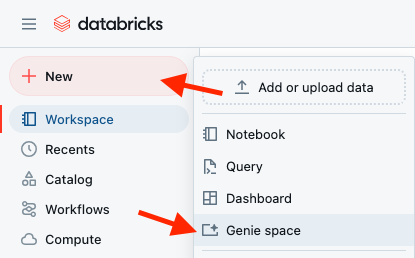<br><br>

2. Selecione as tabelas criadas
        - tb_vendas
        - tb_estoque
        - dim_medicamento
        - dim_loja
3. Clique em `Create`

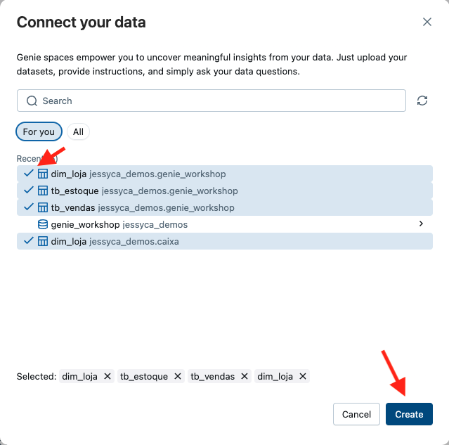

# 02. Configure o Genie

No menu de configurações do Genie temos várias opções, abaixo detalho um pouco do que pode ser feito *(opcional)*.

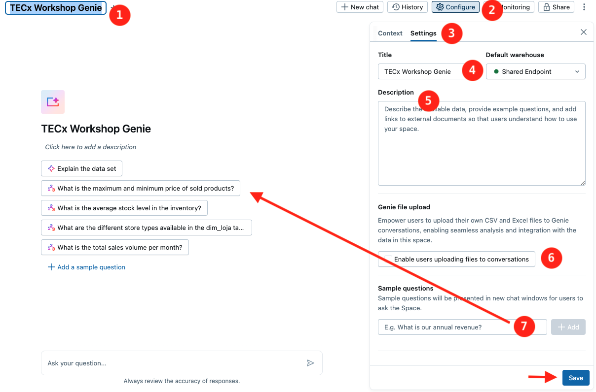

1. Escolha um nome apropriado para a sua sala Genie  
   Defina um nome que reflita com precisão o objetivo ou o conteúdo da sala.
2. Clique em `Configure`
3. Clique em `Settings`
4. Configure o SQL Warehouse - Escolha qual *SQL Warehouse* será utilizado. Esse será o ambiente onde as queries geradas pelo Genie serão executadas.
5. Adicione uma descrição - No campo `Description`, insira um texto explicativo para orientar futuros usuários sobre o propósito da sala e os tipos de perguntas que podem ser feitas.
6. Permita upload de arquivos -  No campo `Genie file upload`, você pode habilitar a opção para que os usuários façam upload de arquivos CSV ou Excel. Esses arquivos poderão ser utilizados nas análises dentro da sala.
7. Defina perguntas de exemplo - Aqui você pode configurar perguntas iniciais que serão exibidas automaticamente quando um novo chat for iniciado. Isso ajuda a guiar os usuários sobre como interagir com o Genie.
8. Clique em `Save` para salvar as alterações - Todas as configurações realizadas só serão aplicadas após salvar.

# 03. Permissões da Sala Genie

No menu de compartilhamento do Espaço Genie é possível adicionar usuários ou grupos e definir permissões com os seguintes passos:
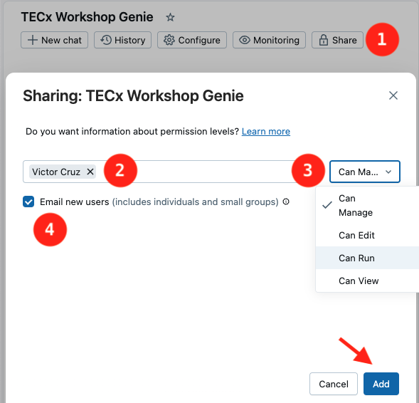
1. Clique em `Share`
2. Adicione usuários/grupos
3. Defina qual tipo de permissão esse usuário terá, elas são:

| Ação                                         | Sem permissão  | CAN VIEW/CAN RUN | CAN EDIT | CAN MANAGE |
|----------------------------------------------|----------------|------------------|-------------|----------------|
| Aparece na lista de salas Genie              | Não            | Sim              | Sim         | Sim            |
| Fazer perguntas ao Genie                     | Não            | Sim              | Sim         | Sim            |
| Fornecer feedback à resposta                 | Não            | Sim              | Sim         | Sim            |
| Adicionar ou editar instruções               | Não            | Não              | Sim         | Sim            |
| Adicionar ou editar perguntas de exemplo     | Não            | Não              | Sim         | Sim            |
| Adicionar ou remover tabelas incluídas       | Não            | Não              | Sim         | Sim            |
| Monitorar uma sala                           | Não            | Não              | Não         | Sim            |
| Modificar permissões                         | Não            | Não              | Não         | Sim            |
| Excluir a sala                               | Não            | Não              | Não         | Sim            |
| Visualizar conversas de outros usuários      | Não            | Não              | Não         | Sim            |
> *Para mais detalhes e possíveis atualizações, consulte a [Documentação Oficial](https://learn.microsoft.com/en-us/azure/databricks/security/auth/access-control/#genie-space).*

4. Defina se deseja enviar um e-mail para esses usuários informando a adição dos mesmos ao espaço Genie
5. Clique em `Add` para salvar as alterações

# 04. Faça perguntas para o seu espaço Genie

Com o Genie Space preparado, podemos começar a fazer nossas análises!

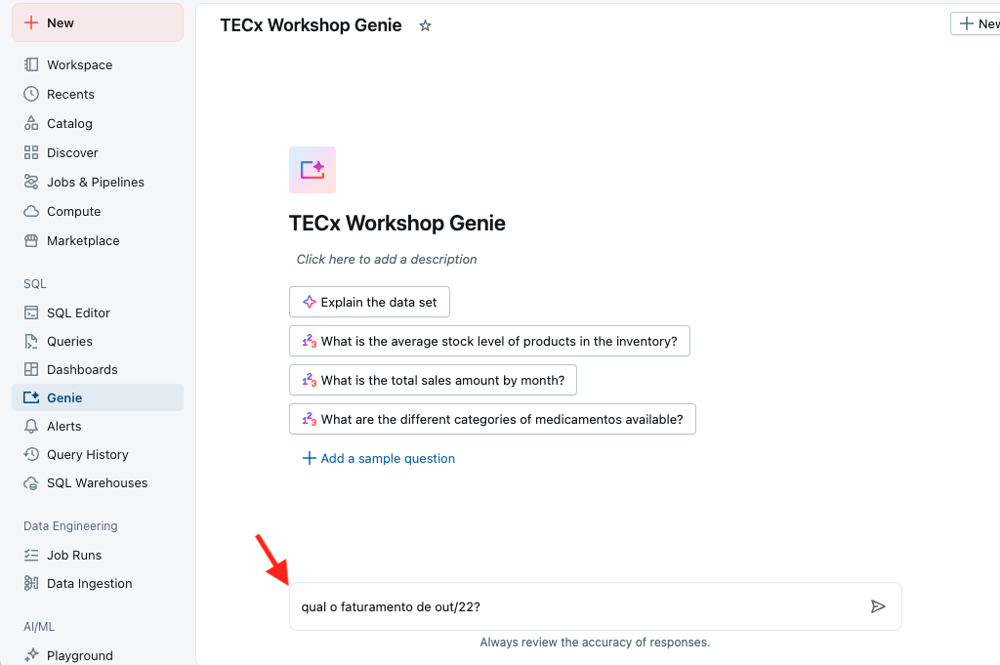

Basta usar o chat para fazer as perguntas abaixo:
- Qual o faturamento em out/22?
- Agora, quebre por produto
- Mantenha somente os 10 produtos com maior faturamento
- Monte um gráfico de barras
- Qual o total de produtos vendidos em genéricos?
- Qual o valor total vendido de ansiolíticos?
- Quais produtos tiveram uma proporção de vendas por estoque maior que 0.8 em Outubro de 2022?

Note que, mesmo com muito pouco contexto, a Genie já conseguiu:
- Inferir quais as tabelas e colunas relevantes para responder nossas perguntas
- Aplicar filtros e agregações
- Responder perguntas adicionais sobre uma resposta anterior
- Entender como utilizar jargões
- Combinar diferentes tabelas
- Calcular métricas derivadas

Aproveite para explorar e fazer perguntas adicionais!

# 05. Usando Comentários

Faça a seguinte pergunta:
> Qual o valor total de venda por loja? Exiba o nome da loja

Note que, apesar de o Genie identificar as tabelas que utilizaria para trazer esse resultado, ele não foi capaz de responder à pergunta de forma correta. Por quê?

No menu `Catalog` > `<nome-do-catalogo>` > `<nome-do-schema>` > `dim_loja`, verifique o nome da coluna que apresenta o nome da loja
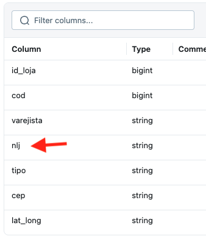

A coluna que contém o nome da loja não está com uma nomenclatura adequada para que o Genie consiga se basear por ela. Vamos adicionar um comentário nessa coluna para que seja possível utilizar a coluna correta para apresentar a informação pedida.
1. Acesse o `SQL Editor`
2. Altere a tabela adicionando o comentário para a coluna **nlj**
`ALTER TABLE dim_loja ALTER COLUMN nlj COMMENT 'Nome da loja'`

**OU**

1. Acesse a tabela via `Catalog` > `<nome-do-catalogo>` > `<nome-do-schema>` > `dim_loja` e adicione o comentário via interface

Após isso faça a pergunta novamente
> Qual o valor total de venda por loja? Exiba o nome da loja

Perceba que dessa vez o Genie utilizou a coluna correta que contém o nome da loja. Documentar as tabelas com comentários é sempre uma boa prática! Isso ajuda a compreensão, a descoberta e o reaproveitamento desses dados por outras pessoas. Além disso, o Genie vai ficar bem mais inteligente.

No entanto, nossa consulta ainda não retornou nenhum resultado. Vamos buscar uma solução!

# 06. Usando Chaves Primárias e Estrangeiras

Aparentemente, a coluna **id_loja** da tabela **dim_loja** não é o melhor campo para fazer os cruzamentos com a tabela de vendas. Na verdade, a coluna correta é a **cod**!

Esse é um cenário que pode acontecer facilmente no mundo real, nem sempre temos tabelas possuem colunas com informações iguais para que o Genie possa inferir os relacionamentos dessas tabelas.

Vamos então adicionar chaves primárias e estrangeiras nessas tabelas para que o Genie possua mais informações de metadados para se basear!

1. Use o SQL Editor para adicionar as chaves primárias e estrangeiras nas tabelas `dim_loja` e `vendas`

``` sql
ALTER TABLE dim_loja ALTER COLUMN cod SET NOT NULL;
ALTER TABLE dim_loja ADD CONSTRAINT pk_dim_loja PRIMARY KEY (cod);
ALTER TABLE tb_vendas ADD CONSTRAINT fk_venda_dim_loja FOREIGN KEY (id_loja) REFERENCES dim_loja(cod);
```
*Isso também pode ser feito via Interface*

2. Faça novamente a pergunta anterior na Genie

Pronto! Com essa informação a Genie já consegue responder a pergunta corretamente!

# 07. Usando Instruções

Como vimos, a Genie utiliza toda a documentação das tabelas para conseguir responder perguntas. No entanto, por motivos de segurança, ela não tem acesso aos dados em si!

Por isso, para complementar o conhecimento que a Genie já possui sobre nossas bases de dados, podemos também criar instruções!

**Instruções** são nada mais que um conjunto de sentenças em linguagem natural que podem explicar para a Genie informações importantes como:
- Significado de abreviações e termos técnicos comumente utilizadas na sua empresa
- Formato do dado (por exemplo, se os registros estão em maiúsculas ou minúsculas)
- Tratamentos necessários para determinados campos
- Cálculos de métricas

Vamos ver como funciona:

1. Faça a pergunta:
> Calcule a quantidade de itens vendidos para prescrição

2. Me parece que o resultado não está correto! Na nossa base, o termo prescrição realmente não é mencionado nenhuma vez. Mas acontece que aqui consideramos como medicamentos de prescrição aqueles que não são genéricos. Por isso, adicione a seguinte instrução:
    - `* para calcular indicadores sobre prescrição use categoria_regulatoria <> 'GENÉRICO'`

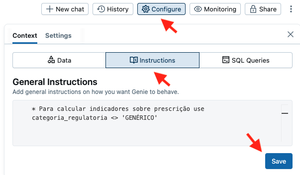

# 08. Usando Exemplos de Query

Em alguns casos, precisamos fazer cruzamentos e cálculos bastante complexos para conseguir responder às nossas perguntas e a Genie pode não entender como montar todo o racional necessário.

Nesses casos, podemos fornecer exemplos de queries validadas e certificadas pelos times responsáveis. Este também é um mecanismo interessante para garantir a acurácia das respostas.

Vamos ver como funciona:

1. Faça a pergunta:
> Calcule a quantidade de itens vendidos por janela móvel de 3 meses 

2. Aqui a Genie já até fez uma soma em janela móvel, porém não ficou exatamente do jeito que nós gostaríamos. Então, adicione um exemplo de query seguindo os passos abaixo:
    - Clique em `Configure` > `SQL Queries`
    - Clique em `Add`
    - Insira a pergunta anterior no campo superior
    - Insira a query abaixo no campo inferior
```sql
SELECT window.end AS dt_venda, SUM(vl_venda) FROM vendas GROUP BY WINDOW(dt_venda, '90 days', '1 day')
```

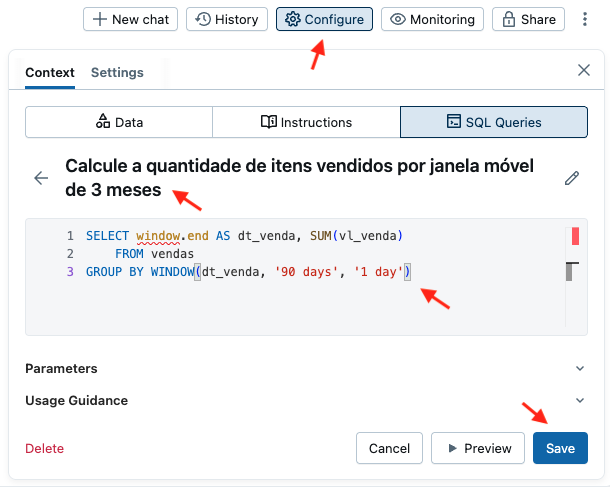

3. Faça novamente a pergunta anterior

Note que agora a Genie conseguiu responder bem melhor a nossa pergunta!

## 08.1. Usando Parâmetros nos Exemplos de Query

Também é possível utilizar **parâmetros dinâmicos** nas queries criadas no Genie. Essa funcionalidade permite definir partes variáveis da consulta, que serão preenchidas automaticamente no momento da execução com base na pergunta do usuário.

1. Defina o exemplo de pergunta com a pergunta direta
> Quero ver as vendas mensais da loja 34006
3. Insira o parâmetro com dois-pontos `:` antes do nome na query definida
   Por exemplo: `:nome_loja`

```sql
SELECT l.nlj, MONTH(v.dt_venda) AS mes, SUM(v.vl_venda) AS total_vendido
FROM tb_vendas v
JOIN dim_loja l ON v.id_loja = l.cod
WHERE l.nlj = :nome_loja
GROUP BY l.nlj, MONTH(v.dt_venda)
ORDER BY mes;
```
2. Digite a pergunta no Genie para acionar o preenchimento dinâmico do parâmetro  
3. O parâmetro será automaticamente detectado pelo Genie  - O valor (`34006`, no exemplo acima) será extraído da pergunta e aplicado na consulta. Ele também aparecerá na interface de configuração, podendo ser ajustado conforme necessário.
4. Também é possível complementar a instrução de Query `Usage Guidance`. Esse campo permite adicionar explicações e exemplos adicionais que ajudam o Genie a entender **em quais outros contextos** a instrução pode ser aplicada. Você pode incluir variações de perguntas, termos equivalentes ou observações úteis para melhorar a precisão da resposta gerada.

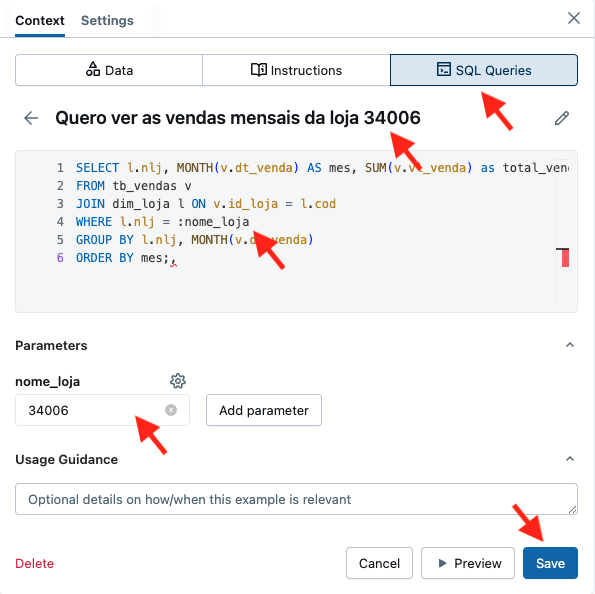

# 09. Usando Funções

Outro recurso que pode ser utilizado para ajudar o Genie com **cálculos complexos** é o uso de **funções SQL definidas pelo usuário**. As **funções** permitem encapsular lógicas complexas de forma parametrizada, facilitando sua reutilização por outras pessoas e consultas, inclusive fora do Genie. Elas são especialmente úteis para garantir que o Genie utilize regras de negócio padronizadas e aprovadas pela organização.

O Databricks trata as funções como **ativos gerenciáveis**, o que significa que elas governadas como qualquer outro objeto do catálogo. Sendo possível definir permissões para restringir quem pode utilizá-las e reaproveitá-las em Consultas SQL, Dashboards, Modelos, Espaços Genie, Pipelines de dados, etc.

## Exemplo prático

1. Faça a seguinte pergunta ao Genie:
> Qual o lucro projetado do AAS?
2. O Genie pode tentar responder, mas provavelmente não seguirá as regras internas da empresa — por exemplo, a margem de lucro diferenciada para medicamentos genéricos e não genéricos.
3. Para resolver isso, podemos criar uma **função que calcula o lucro projetado de um medicamento** com base na regra oficial de negócio, e disponibilizá-la para o Genie utilizar.

## 09.1. Criando funções no Databricks

1. No menu lateral esquerdo, clique em `SQL Editor`
2. Crie a função com a lógica de negócio
``` sql
CREATE OR REPLACE FUNCTION calc_lucro(medicamento STRING)
  RETURNS TABLE(nome_medicamento STRING, lucro_projetado DOUBLE)
  COMMENT 'Use esta função para calcular o lucro projetado de um medicamento'
  RETURN 
    SELECT
      m.nome_medicamento,
      sum(case when m.categoria_regulatoria == 'GENÉRICO' then 1 else 0.5 end * v.vl_venda) / sum(v.qt_venda) as lucro_projetado
    FROM tb_vendas v
    LEFT JOIN dim_medicamento m
    ON v.id_produto = m.id_produto
    WHERE m.nome_medicamento = calc_lucro.medicamento
    GROUP BY ALL
```
## 09.2. Adicionando a função ao Genie

1. No menu `SQL Queries`, clique em `Add` > `SQL Function`
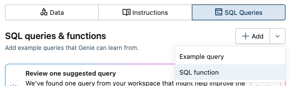

3. Selecione a função recém-criada `calc_lucro`
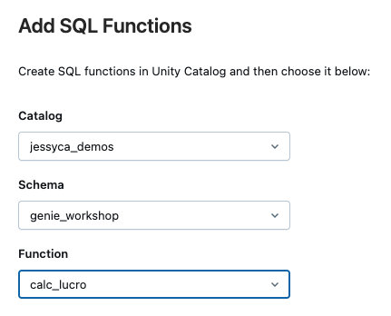

5. Faça novamente a pergunta ao Genie:
> Qual o lucro projetado do AAS?

Perceba que agora o Genie foi capaz de utilizar a função `calc_lucro` e responder com base na lógica certificada, garantindo alinhamento com as regras internas da empresa.

# 10. Monitoramento

Durante toda a interação com o espaço Genie, você deve ter percebido que, logo abaixo de cada resposta gerada, aparecem as opções: `Yes`, `Fix It` e `Request Review`.


Essas opções são fundamentais para o processo de **melhoria contínua do espaço Genie**. Elas permitem que os usuários forneçam feedbacks valiosos e que os administradores acompanhem, ajustem e otimizem as instruções e respostas geradas.

### Como cada opção funciona

- **Yes**  
  Indica que a resposta gerada atendeu corretamente à pergunta.  
  O Genie registra esse feedback como positivo e passa a reutilizar a resposta em futuras interações com perguntas semelhantes feitas por outros usuários.

- **Fix It**  
  Permite que o próprio usuário adicione mais detalhes, reformule a pergunta ou melhore a resposta.  
  A interação original será enviada aos administradores, que poderão utilizar esse contexto para **adicionar novas instruções, ajustar consultas ou melhorar o comportamento do espaço** com base no seu feedback.

- **Request Review**  
  Abre uma solicitação formal para que o administrador revise a resposta gerada.  
  Essa opção é ideal quando o usuário não sabe exatamente o que está errado, mas identifica que a resposta não está adequada. O administrador poderá analisar o caso, corrigir a lógica e retornar com uma solução melhor.

Essas funcionalidades são extremamente importantes tanto na fase de **validação inicial** do espaço Genie quanto em sua **manutenção contínua**. Elas garantem que o espaço evolua de forma colaborativa, com base na experiência real dos usuários.

*ℹ️ Informações atualizadas em Agosto de 2025. Em caso de atualizações verifique a [Documentação Oficial|https://learn.microsoft.com/en-us/azure/databricks/genie/set-up].*
